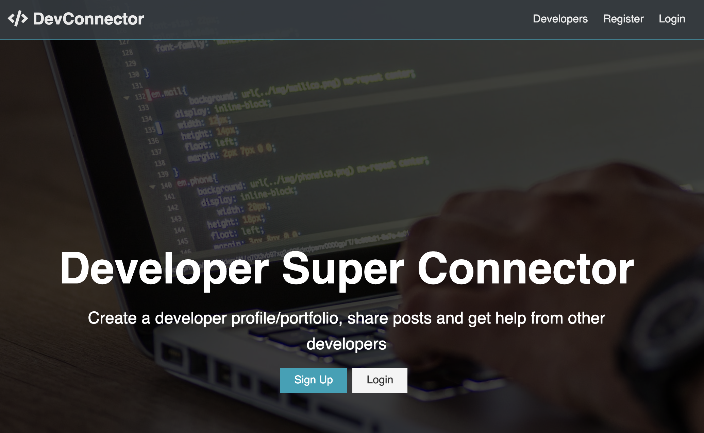
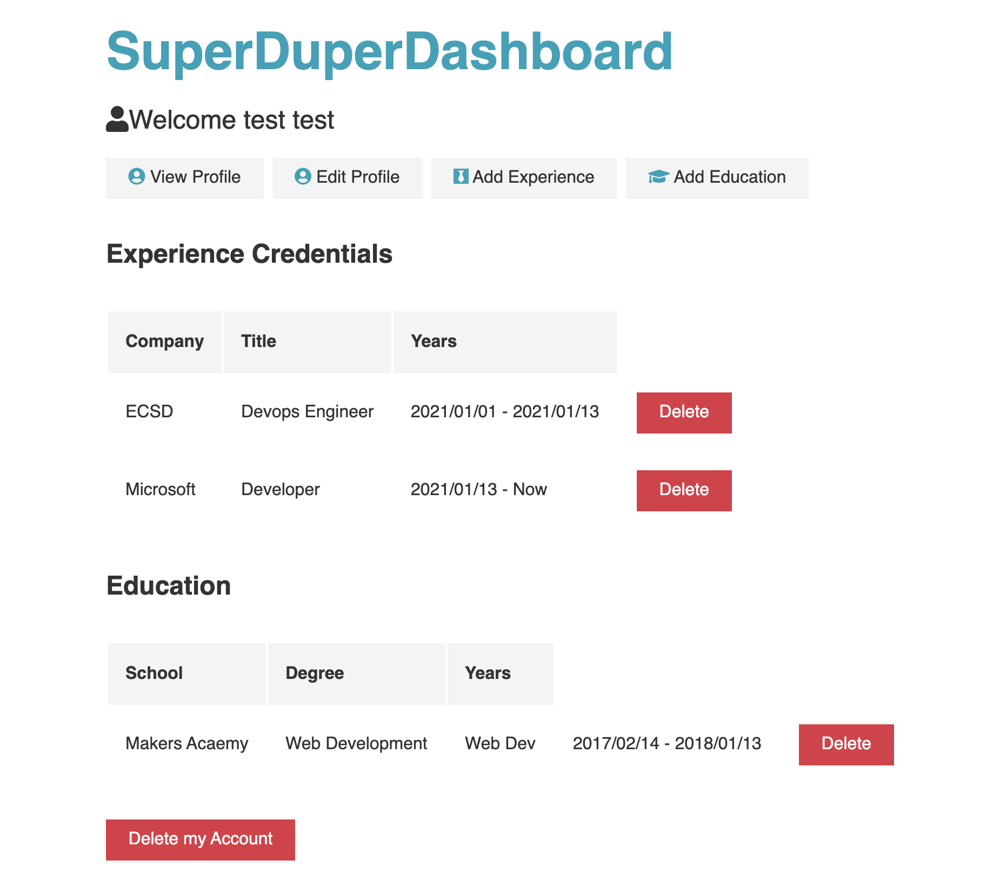
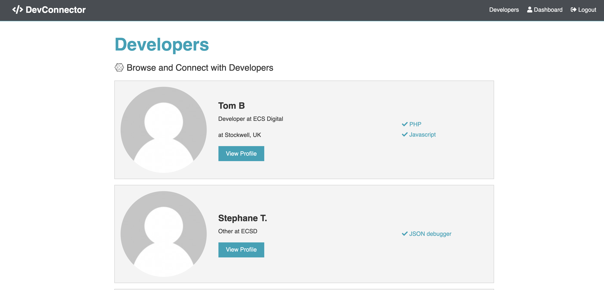
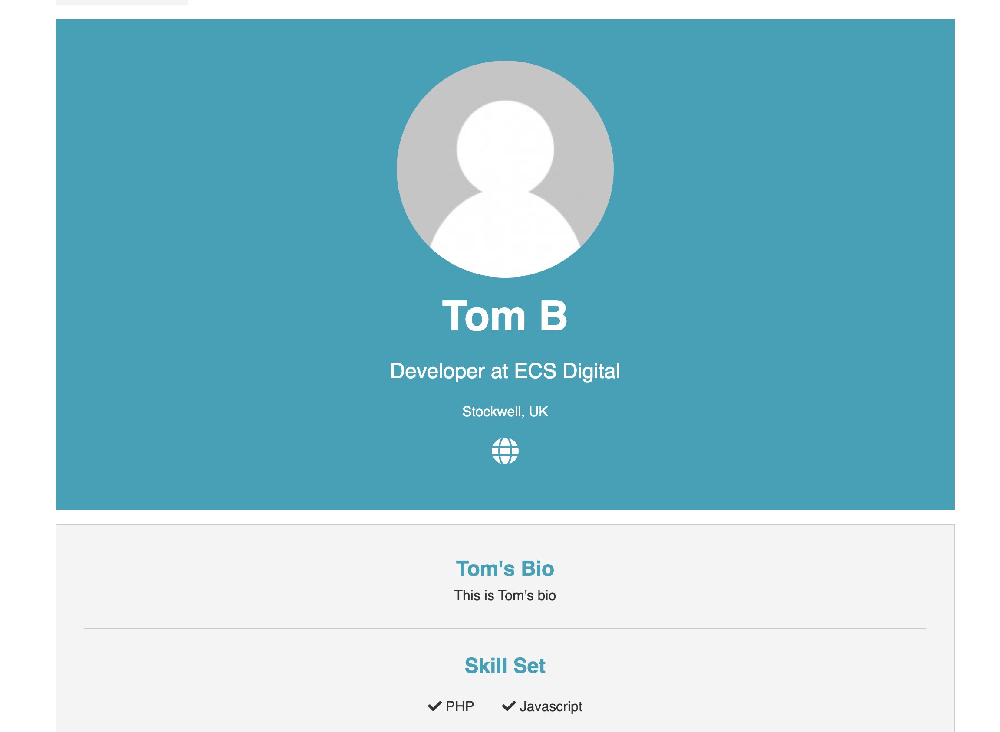
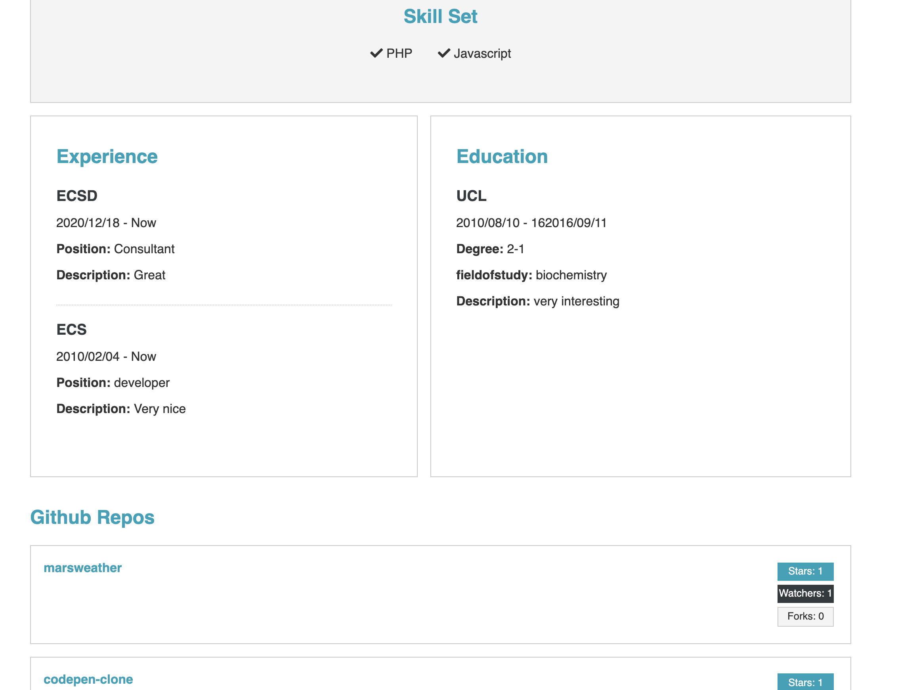

[Abstract](#abstract) | [Objective](#objective) | [Tech Stack](#Tech-Stack) | [Screenshots](#screenshots) | [Improvements](#improvements)

## Abstract

DevConnector - A social media site for developers to network on. Users can register, log in, generate a profile, add experience, skills, social links to their profile and view other developers' profiles.

Currently hosted at https://prod.t.useyourbra.in/

See screenshots in the [screenshots](#screenshots) section

## Objective

I created this app as a way to learn how to implement a simple three tier application using React for the front end, using Redux to manage the state of the application, and also incorporating a backend REST api with routing built using Node JS and Express. Once this was complete, I containerised the app using docker with the intention of creating a full development workflow with CI/CD pipelines that autoamtically build and deploy new versions of the app upon merges to master/branches.

I also began hosting both production and development environments to simulate on a low budget an actualy development environment. This however is covered in my [repo for the hosting infrastructure](https://github.com/Mnargh/MERN-stack-infra "MERN-stack-infra").

## Tech-Stack

[React](https://reactjs.org/) - Front End

[Node.js](https://nodejs.org/en/) - Runtime

[Express](https://expressjs.com/) - Backend server and routing

[MongoDB Atlas](https://www.mongodb.com/cloud/atlas) - Database

[Redux](https://redux.js.org/) - State Management 

[Docker](https://www.docker.com/) - Containerisation

[JSON Web Token](https://jwt.io/) - Authentication

The application is hosted on a docker container running on an AWS EC2 instance using Terraform. Take a look at the [repo for the hosting infrastructure](https://github.com/Mnargh/MERN-stack-infra "MERN-stack-infra") to see the code for this.

## Screenshots

### Homepage

### Dashboard

### Developers

### ProfileTop

### ProfileBottom

## Improvements to implement in future given more time

1. Add unit tests using Jest, and E2E/integration tests using Cypress

2. Make the experience more complete and finished - e.g. Adding ability to edit all aspects of a profile once complete.

3. Update the CSS to make the UX more stylish. This was not the main focus of this project, however there are significant improvements to the design that could be made to make the site look more like a finished product.

4. Complete gitlab yaml file to automate building and pushing of semantically versioned container to AWS ECR each time a change to the master branch occured. This would then be deployed automatically to the server to update the production/development environment as necessary.

5. Implement posting and comments from each developer.

6. Add real time chat feature using Socket.io

